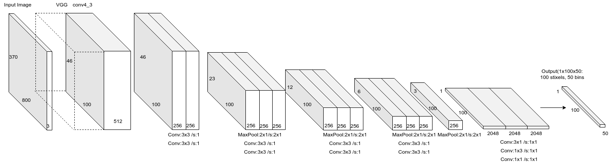
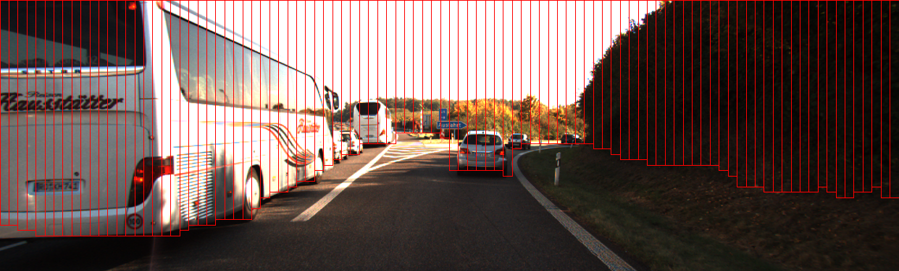

[](https://opensource.org/licenses/MIT)

# Obstacle Detection With StixelNet (v2)

This project implements obstacle detection based on the StixelNet paper. This version (v2) has been refactored and updated for modern GPU environments (such as NVIDIA RTX 5070) and fixes compatibility issues with related libraries.

## 🚀 Quick Navigation
To help you quickly understand the project, the following comprehensive guides have been integrated into this document:
* **[Project Workflow Guide](#project-workflow-guide)**: A complete step-by-step list from data preparation to training, testing, and plotting.
* **[Project File Guide](#project-file-guide)**: Detailed descriptions of the functions of each folder and file within the project.

## 🛠 Dependencies
The project has been tested and verified in the following environments:
* **OS**: Windows 10/11 (Ubuntu is also supported)
* **GPU**: NVIDIA RTX 5070 series (and other CUDA-supported graphics cards)
* **Python**: 3.10 / 3.13.9
* **Tensorflow**: 2.10.1 (Stable version supported by native Windows GPUs)
* **Albumentations**: 1.3.1 (Augmentation syntax compatibility fixed)

### Install Dependencies:
```powershell
pip install -r requirements.txt
```

## 📂 Training Data

### KITTI Raw Dataset

This project uses automatically generated labels. The data is sourced from KITTI Velodyne point clouds projected onto 2D images to generate Stixel coordinates.

### Download Dataset (If you do not have the data yet)

```powershell
python ./scripts/download_kitti_stixels.py
```

*Note: The complete dataset is about 5.4GB. If images already exist in `data/kitti_stixel_images/`, you can skip this step.*

## 🏗 StixelNet Model

-----


## 🏋️ Training

After configuring the data, run the following command to start training:

```powershell
python ./train.py --batch_size 16 --num_epoch 50
```

* **Model weights** will be automatically saved in the `./saved_models/` folder (format: `model-xxx.h5`).
* **Advanced Settings**: You can adjust the batch size using `--batch_size` based on your device's VRAM capacity.

## 🔍 Test & Evaluation

### Single Image Testing & Visualization

* Download pre-trained weights:

```powershell
python ./scripts/download_kitti_stixels_model_weights.py
```

* Run the test (please replace the model path accordingly):

```powershell
python ./test_single_image.py --model_path ./saved_models/model.h5
```

### Comprehensive Evaluation & Plotting

* Automatically calculate AUC metrics on the validation set and generate analysis charts:

```powershell
python ./evaluate_stixelnet.py
```

* Reproduce the comparison chart from the paper (Figure 6):

```powershell
python ./plot_figures.py
```

## 📊 Sample Result

-----


## 📚 References

* [StixelNet: A Deep Convolutional Network for Obstacle Detection and Road Segmentation](http://www.bmva.org/bmvc/2015/papers/paper109/paper109.pdf)
* [Real-time category-based and general obstacle detection for autonomous driving](http://openaccess.thecvf.com/content_ICCV_2017_workshops/papers/w3/Garnett_Real-Time_Category-Based_and_ICCV_2017_paper.pdf)

-----

## Project Workflow Guide

This section explains the complete workflow from data preparation to model training and evaluation.

### 1. Dataset Preparation

* **Raw Label File**: `data/StixelsGroundTruth.txt` (contains images and corresponding object locations).
* **Image Data**: `.png` files located under the `data/kitti_stixel_images/` folder.
* **Auxiliary Scripts**:
    * `scripts/download_kitti_stixels.py`: Downloads the complete Kitti Stixel training data.
    * `scripts/download_kitti_stixels_model_weights.py`: Downloads the pre-trained `.h5` model weights.

### 2. Data Processing & Loading

* **Processing File**: `data_loader/kitti_stixel_dataset.py` (The core module responsible for parsing labels and automatically allocating Train/Val stages).
* **Auxiliary Tools**:
    * `utility/parseTrackletXML.py`: Parses Kitti's tracklet format.
    * `utility/transforms.py`: Performs data augmentation (e.g., HorizontalFlip).

### 3. Model Training

* **Training Entry Point**: Execute **`train.py`**.
* **Network Architecture**: Located in `models/stixel_net.py`.
* **Loss Function**: Located in `models/stixel_loss.py` (StixelLoss).
* **Global Configuration**: `config.py` (Defines data paths, image resolution, batch size, etc.).

### 4. Weights & Output Generation

* **Save Location**: `saved_models/`.
* **Output Filename**: Automatically generates files named `model-{epoch:03d}.h5`.

### 5. Inference & Single Image Testing

* **Execution File**: `test_single_image.py`.
    * Loads the `.h5` weights, performs inference on a single image, and displays the visualized detection results (Stixels).

### 6. Evaluation & Analysis Charts

* **Performance Evaluation**: Execute **`evaluate_stixelnet.py`**.
    * Scans all images in the validation set and calculates the AUC (Area Under Curve) metric.
    * **Output Chart**: `evaluate_stixelnet_results.png` (Contains the PR curve and error distribution).
* **Plotting Analysis**: Execute **`plot_figures.py`**.
    * Generates an experimental comparison chart similar to the one in the paper.
    * **Output Chart**: `figure_6_reproduction.png`.

-----

## Project File Guide

This section details the functions of each folder and file in the project, helping you quickly understand the project architecture.

### 📂 Directories

| Directory Name | Description |
| :--- | :--- |
| `data/` | Stores the Kitti dataset, label files (`StixelsGroundTruth.txt`), and training/validation lists. |
| `data_loader/` | Contains data reading and preprocessing logic, such as `kitti_stixel_dataset.py` for encapsulating dataset loading. |
| `models/` | Defines the neural network structure (`stixel_net.py`) and loss function (`stixel_loss.py`). |
| `saved_models/` | Used to store trained model weight files (`.h5` format). |
| `scripts/` | Utility scripts. Includes dataset downloading (`download_kitti_stixels.py`) and pre-trained weights downloading. |
| `utility/` | Core utility functions. Contains the XML parser (`parseTrackletXML.py`), data conversion, and image augmentation tools. |
| `notebooks/` | Jupyter Notebook files used for experiments, data exploration, and prototype development. |
| `docs/` | Stores project documentation, flowcharts, and diagrams used in the README. |
| `third_party/` | Stores third-party packages or externally referenced code modules. |
| `__pycache__/` | Automatically generated Python cache files (usually do not need manual modification). |

### 📄 Main Files

#### Core Execution Programs

* **`train.py`**
  The main entry point of the project. Used to configure the training workflow, including data loading, model initialization, the training loop, and saving weights.
* **`test_single_image.py`**
  Testing script. Can load specific model weights, perform inference on a single image, and display visualized prediction results.
* **`evaluate_stixelnet.py`**
  Used to evaluate model performance metrics on the validation or test set.
* **`plot_figures.py`**
  Plotting script. Used to generate model performance analysis charts (e.g., PR curves, error distribution charts).

#### Configuration & Environment

* **`config.py`**
  The global configuration file for the project. Defines data paths, hyperparameters (Batch Size, Learning Rate), image dimensions, and other important settings.
* **`requirements.txt`**
  Lists the required Python dependencies and their version numbers. Execute `pip install -r requirements.txt` to install them.

### 🛠️ Development Suggestions

If you need to modify the model architecture, please check `models/stixel_net.py`; if you need to adjust training parameters or paths, directly modify `config.py`.